# TDP Platform - C4 Architecture Diagrams

## Overview

This document presents the TDP platform architecture using C4 model diagrams, providing multiple levels of abstraction for understanding the system.

---

## Level 1: System Context Diagram

Shows how the TDP platform fits into the broader ecosystem of users and external systems.

```mermaid
flowchart LR
    %% =======================
    %% Actors
    %% =======================
    Researcher["👨‍🔬 Researcher / Scientist\n(End User)"]
    Browser["🌐 Web Browser"]

    %% =======================
    %% System Boundary
    %% =======================
    subgraph TDP["🧬 Target Discovery Platform (System Boundary)"]
        UC1(("Query gene interactions\nand disease associations"))
        UC2(("View gene analytics\nand properties"))
        UC3(("Perform pathway enrichment\nanalysis (GSEA)"))
        UC4(("Access protected\nresearch data"))
        UC5(("Manage session\n& authentication"))
        UC6(("Cache frequently\naccessed results"))
        UC7(("Submit feedback\nand feature requests"))
    end

    %% =======================
    %% Actor Interactions
    %% =======================
    Researcher -->|"Uses via browser"| Browser
    Browser --> UC1
    Browser --> UC2
    Browser --> UC3
    Browser --> UC4
    Browser --> UC7

    %% =======================
    %% Included / Supporting Use Cases
    %% =======================
    UC1 -->|"<<includes>>\nGraphQL queries"| UC5
    UC2 -->|"<<includes>>\nAnalytics fetch"| UC5
    UC4 -->|"<<includes>>\nAccess control"| UC5

    UC1 -->|"<<includes>>\nRead cache"| UC6
    UC2 -->|"<<includes>>\nRead cache"| UC6

    %% =======================
    %% Styling
    %% =======================
    style Researcher fill:#08427b,stroke:#052e56,color:#ffffff
    style Browser fill:#4f6bed,stroke:#2f3fb3,color:#ffffff

    style TDP fill:#1168bd,stroke:#0b4884,color:#ffffff
    style UC1 fill:#ffffff,stroke:#333,color:#000000
    style UC2 fill:#ffffff,stroke:#333,color:#000000
    style UC3 fill:#ffffff,stroke:#333,color:#000000
    style UC4 fill:#ffffff,stroke:#333,color:#000000
    style UC5 fill:#f4f6f7,stroke:#555,color:#000000
    style UC6 fill:#f4f6f7,stroke:#555,color:#000000
    style UC7 fill:#ffffff,stroke:#333,color:#000000
```



### Context Description

| Element | Type | Description |
|---------|------|-------------|
| Researcher | Person | Primary user who queries gene interactions, analyzes expression data, and identifies drug targets |
| Administrator | Person | Manages platform configuration, data ingestion, and database maintenance |
| TDP Platform | System | Core bioinformatics platform for target discovery |
| Open Targets | External System | Provides gene-disease association scores and evidence |
| KEGG/Reactome | External System | Provide pathway definitions for GSEA analysis |
| BioGRID | External System | Source of protein-protein interaction data |
| NCBI | External System | Gene reference and nomenclature data |

---

## Level 2: Container Diagram

Shows the high-level containers (applications/services) within the TDP platform.


### Container Descriptions

| Container | Technology | Responsibility |
|-----------|------------|----------------|
| API Gateway | Nginx 1.28 | Routes requests, handles compression, manages timeouts |
| Frontend | Next.js 15, React 19 | Renders UI, manages client state, visualizes data |
| Backend API | NestJS, GraphQL | Processes queries, manages sessions, orchestrates data |
| GSEA Service | FastAPI, gseapy | Performs pathway enrichment analysis |
| Graph Database | Neo4j 5.26 | Stores and queries gene/protein networks |
| Analytics Database | ClickHouse 25.8 | Fast analytical queries on gene properties |
| Session Store | PostgreSQL 16 | Persists sessions, feedback, access control |
| Cache | Redis 8.2 | Caches query results, manages graph lifecycle |
| File Storage | Filesystem | Stores data commons files |

---

## Level 3: Component Diagram - Backend

Detailed view of the NestJS backend components.

```mermaid
flowchart TB
    subgraph backend["Backend API Container"]
        subgraph core["Core"]
            AppModule["📦 AppModule\nRoot module"]
            Main["🚀 Main\nBootstrap, CORS,\ncompression"]
        end

        subgraph resolvers["GraphQL Layer"]
            GqlResolver["🔍 GqlResolver\nGene queries,\ninteractions"]
            CHResolver["📊 ClickhouseResolver\nProperties, scores,\nassociation tables"]
        end

        subgraph services["Business Services"]
            GqlService["⚙️ GqlService\nQuery processing,\nhash computation"]
            CHService["📈 ClickhouseService\nSQL queries,\nmigrations"]
            Neo4jService["🔷 Neo4jService\nSession pooling,\ngraph binding"]
            RedisService["⚡ RedisService\nCaching, TTL events"]
            AlgoService["🧮 AlgorithmService\nLeiden clustering,\ncommunity detection"]
        end

        subgraph rest["REST Controllers"]
            DCController["📁 DataCommonsController\nFile serving,\nauthentication"]
            FeedbackController["💬 FeedbackController\nUser feedback\nCRUD"]
        end

        subgraph support["Support Services"]
            DCService["DataCommonsService\nJWT auth, file ops"]
            FeedbackService["FeedbackService\nPrisma operations"]
        end

        subgraph cron["Background Jobs"]
            CronJobs["⏰ Cron Jobs\nSession cleanup\n(4x daily)"]
        end
    end

    subgraph external["External Services"]
        Neo4j["Neo4j"]
        ClickHouse["ClickHouse"]
        PostgreSQL["PostgreSQL"]
        Redis["Redis"]
        FileSystem["Filesystem"]
    end

    Main --> AppModule
    AppModule --> GqlResolver
    AppModule --> CHResolver
    AppModule --> DCController
    AppModule --> FeedbackController
    
    GqlResolver --> GqlService
    GqlResolver --> RedisService
    CHResolver --> CHService
    
    GqlService --> Neo4jService
    GqlService --> AlgoService
    
    DCController --> DCService
    FeedbackController --> FeedbackService
    
    Neo4jService --> Neo4j
    Neo4jService --> RedisService
    CHService --> ClickHouse
    DCService --> PostgreSQL
    DCService --> FileSystem
    FeedbackService --> PostgreSQL
    RedisService --> Redis
    
    CronJobs --> PostgreSQL

    style GqlResolver fill:#facc15,stroke:#a16207,color:#000000
    style CHResolver fill:#facc15,stroke:#a16207,color:#000000
    style DCController fill:#4ade80,stroke:#166534,color:#000000
    style FeedbackController fill:#4ade80,stroke:#166534,color:#000000
```



### Component File Mapping

| Component | Source File |
|-----------|-------------|
| AppModule | `backend/src/app.module.ts` |
| Main | `backend/src/main.ts` |
| GqlResolver | `backend/src/gql/gql.resolver.ts` |
| ClickhouseResolver | `backend/src/gql/clickhouse.resolver.ts` |
| GqlService | `backend/src/gql/gql.service.ts` |
| ClickhouseService | `backend/src/clickhouse/clickhouse.service.ts` |
| Neo4jService | `backend/src/neo4j/neo4j.service.ts` |
| RedisService | `backend/src/redis/redis.service.ts` |
| AlgorithmService | `backend/src/algorithm/algorithm.service.ts` |
| DataCommonsController | `backend/src/data-commons/dataCommons.controller.ts` |
| DataCommonsService | `backend/src/data-commons/dataCommons.service.ts` |
| FeedbackController | `backend/src/feedback/feedback.controller.ts` |
| FeedbackService | `backend/src/feedback/feedback.service.ts` |
| Cron Jobs | `backend/src/cron/index.ts` |

---

## Level 3: Component Diagram - Frontend

Detailed view of the Next.js frontend components.

```mermaid
flowchart TB
    subgraph frontend["Frontend Container"]
        subgraph routing["App Router"]
            Layout["🎨 Layout\nRoot layout,\nNavbar, Footer"]
            NetworkPage["🔗 Network Page\nGraph visualization"]
            DataPage["📊 Data Page\nData commons browser"]
            DocsPage["📖 Docs Page\nNextra documentation"]
            FeedbackPage["💬 Feedback Page\nUser feedback form"]
        end

        subgraph visualization["Visualization Components"]
            GraphViz["🕸️ Graph Visualization\nSigma.js, Graphology"]
            Heatmap["🗺️ Heatmap\nGene properties"]
            VolcanoPlot["🌋 Volcano Plot\nDifferential expression"]
            BoxPlot["📦 Box Plot\nExpression analysis"]
            PCAPlot["📐 PCA Plot\nDimensionality reduction"]
        end

        subgraph data["Data Layer"]
            ApolloWrapper["🔄 Apollo Wrapper\nGraphQL client"]
            GqlQueries["📝 GQL Queries\nQuery definitions"]
            Hooks["🪝 Custom Hooks\nData fetching"]
        end

        subgraph ui["UI Components"]
            UILib["🎯 UI Library\nshadcn/ui, Radix"]
            Panels["📋 Panels\nLeft/Right sidebars"]
            Controls["🎛️ Controls\nFilters, sliders"]
        end

        subgraph state["State Management"]
            Zustand["🐻 Zustand Stores\nGlobal state"]
            LocalState["📍 Local State\nReact useState"]
        end
    end

    Layout --> NetworkPage
    Layout --> DataPage
    Layout --> DocsPage
    Layout --> FeedbackPage
    
    NetworkPage --> GraphViz
    NetworkPage --> Heatmap
    DataPage --> VolcanoPlot
    DataPage --> BoxPlot
    DataPage --> PCAPlot
    
    GraphViz --> Hooks
    Heatmap --> Hooks
    VolcanoPlot --> Hooks
    
    Hooks --> ApolloWrapper
    ApolloWrapper --> GqlQueries
    
    NetworkPage --> Panels
    Panels --> UILib
    Controls --> UILib
    
    GraphViz --> Zustand
    Panels --> Zustand

    style GraphViz fill:#f472b6,stroke:#9d174d,color:#000000
    style Heatmap fill:#f472b6,stroke:#9d174d,color:#000000
    style VolcanoPlot fill:#f472b6,stroke:#9d174d,color:#000000
```



### Frontend Directory Structure

```
frontend/
├── app/
│   ├── (navbar)/           # Routes with navigation
│   │   ├── (sidebar)/      # Routes with sidebar
│   │   ├── feedback/       # Feedback form
│   │   └── view-feedback/  # Feedback list
│   ├── data/               # Data commons
│   ├── docs/               # Documentation (Nextra)
│   └── network/            # Network visualization
├── components/
│   ├── graph/              # Sigma.js components
│   ├── data-commons/       # Analysis components
│   │   ├── DifferentialExpression/
│   │   ├── TranscriptExpression/
│   │   └── PCA/
│   ├── heatmap/            # Heatmap components
│   ├── left-panel/         # Left sidebar
│   ├── right-panel/        # Right sidebar
│   ├── legends/            # Chart legends
│   └── ui/                 # shadcn/ui components
├── lib/
│   ├── apolloWrapper.tsx   # Apollo Client setup
│   ├── gql.ts              # GraphQL queries
│   ├── graph/              # Graph utilities
│   ├── hooks/              # Custom hooks
│   └── utils.ts            # Utilities
```

---

## Database Schema Diagrams

### Neo4j Graph Schema

```mermaid
graph LR
    subgraph Nodes["Node Labels"]
        Gene["Gene\n• ID (String)\n• Gene_name\n• Description\n• hgnc_gene_id\n• Aliases[]"]
        Disease["Disease\n• ID (String)\n• name"]
        GeneAlias["GeneAlias\n• Gene_name"]
        Property["Property\n• name\n• category\n• description"]
    end

    subgraph Relationships["Relationships"]
        Gene -->|"PPI\n(score: Float)"| Gene
        Gene -->|"FUN_PPI\n(score: Float)"| Gene
        Gene -->|"BIO_GRID\n(score: Float)"| Gene
        Gene -->|"INT_ACT\n(score: Float)"| Gene
        GeneAlias -->|"ALIAS_OF"| Gene
        Disease -->|"HAS_PROPERTY"| Property
    end

    style Gene fill:#4f46e5,stroke:#3730a3,color:#ffffff
    style Disease fill:#dc2626,stroke:#991b1b,color:#ffffff
    style GeneAlias fill:#059669,stroke:#047857,color:#ffffff
    style Property fill:#d97706,stroke:#92400e,color:#ffffff
```



### ClickHouse Analytics Schema


### PostgreSQL Session Schema


**Prisma Schema Reference**: `backend/prisma/schema.prisma`

---

## Infrastructure Topology

### Docker Network Layout

```mermaid
flowchart TB
    subgraph internet["Internet"]
        Client["Client Browser"]
    end

    subgraph docker["Docker Host"]
        subgraph pdnet["pdnet-network (bridge)"]
            GW["api-gateway\n:80 → :5000"]
            
            subgraph apps["Application Tier"]
                FE["frontend :80"]
                BE["nestjs :4000"]
                GS["gsea :5000"]
            end
            
            subgraph data["Data Tier"]
                N4J["neo4j :7687"]
                CH["clickhouse :8123"]
                PG["postgres :5432"]
                RD["redis :6379"]
            end
            
            subgraph volumes["Persistent Volumes"]
                V1["neo4j-data"]
                V2["clickhouse-data"]
                V3["postgres-data"]
                V4["redis-cache"]
            end
        end
    end

    Client --> GW
    GW --> FE
    GW --> BE
    GW --> GS
    BE --> N4J
    BE --> CH
    BE --> PG
    BE --> RD
    
    N4J -.-> V1
    CH -.-> V2
    PG -.-> V3
    RD -.-> V4

    style GW fill:#f97316,stroke:#c2410c,color:#ffffff
    style FE fill:#3b82f6,stroke:#1d4ed8,color:#ffffff
    style BE fill:#3b82f6,stroke:#1d4ed8,color:#ffffff
    style GS fill:#3b82f6,stroke:#1d4ed8,color:#ffffff
    style N4J fill:#10b981,stroke:#059669,color:#ffffff
    style CH fill:#10b981,stroke:#059669,color:#ffffff
    style PG fill:#10b981,stroke:#059669,color:#ffffff
    style RD fill:#10b981,stroke:#059669,color:#ffffff
```



---

## Deployment Environments


### Environment Comparison

| Aspect | Production | Development |
|--------|------------|-------------|
| External Ports | 5000 only | All services exposed |
| Hot Reload | No | Yes (with volume mounts) |
| Debug Access | No | Direct DB access |
| Logging | Minimal | Verbose |
| Compose File | `docker-compose.yml` | `docker-compose.yml` + `docker-compose.dev.yml` |

---

## Security Boundaries


### Security Controls

| Layer | Control | Implementation |
|-------|---------|----------------|
| Gateway | Rate limiting | Nginx config (configurable) |
| Gateway | Compression | gzip enabled |
| Backend | CORS | Origin validation in production |
| Backend | Authentication | JWT + HTTP-only cookies |
| Backend | Session management | Redis TTL, PostgreSQL tracking |
| Database | Network isolation | Docker bridge network |
| Database | Authentication | Password-protected connections |
