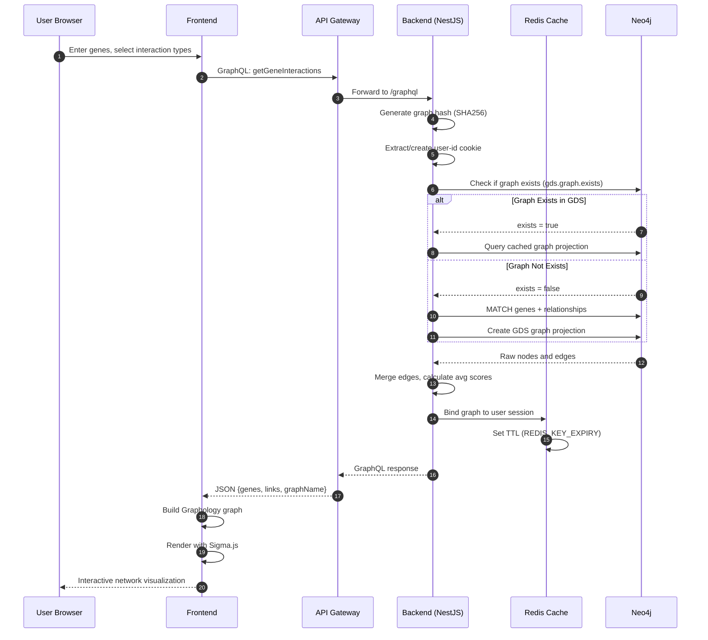
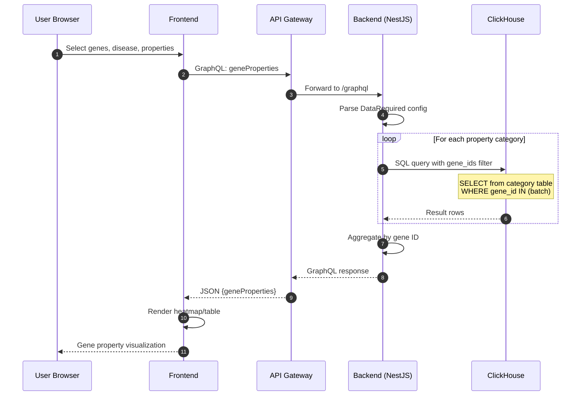
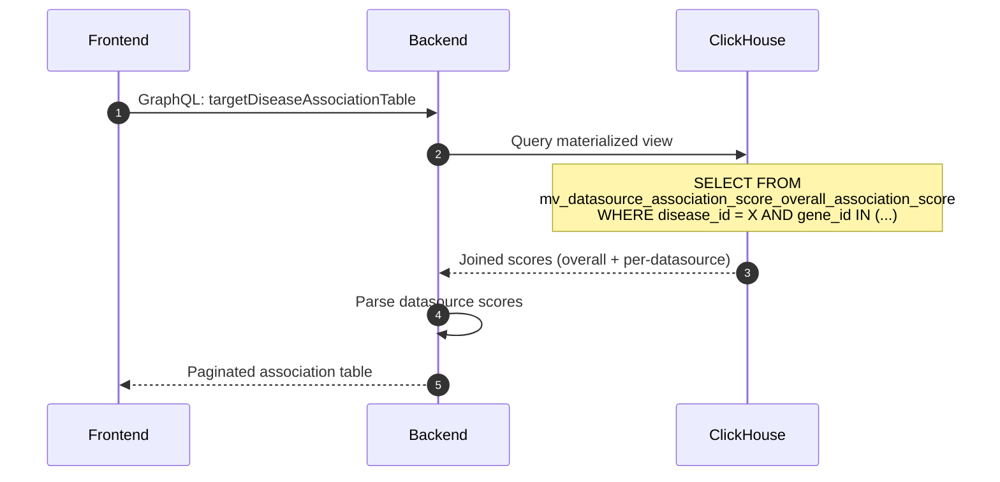
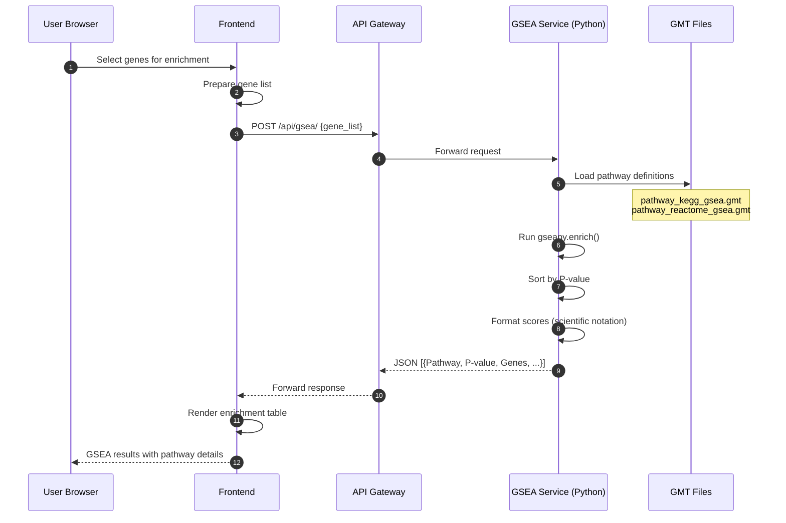
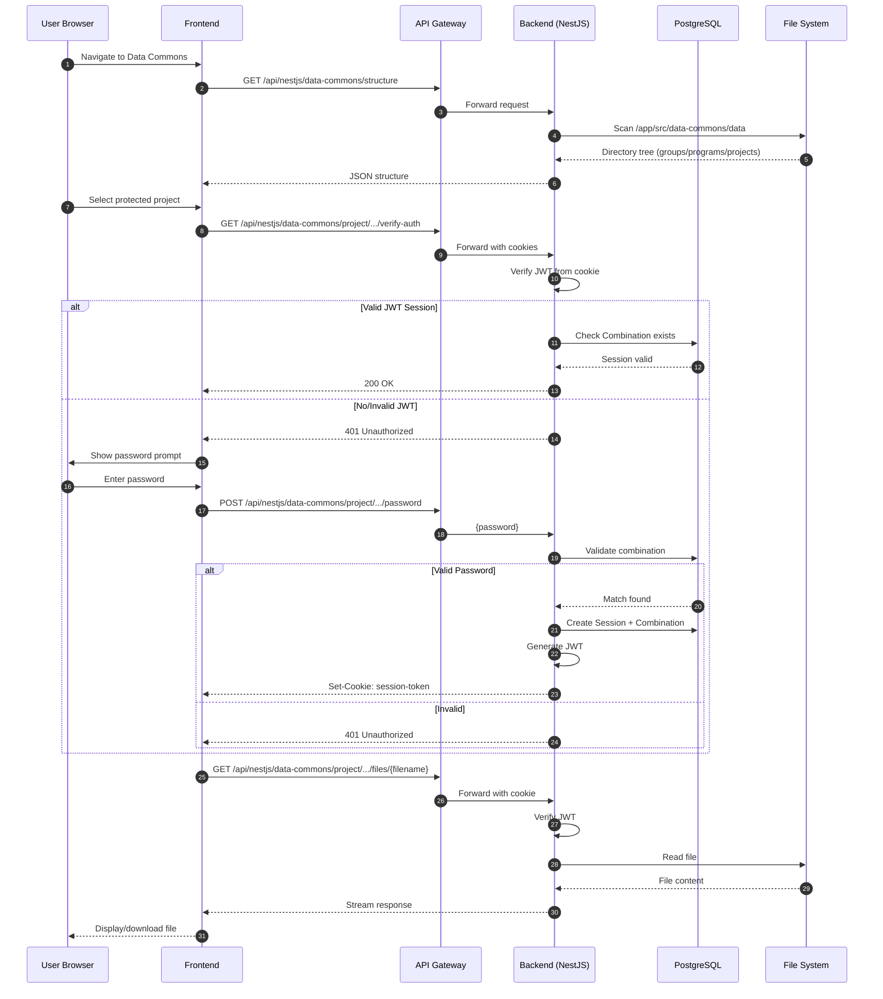
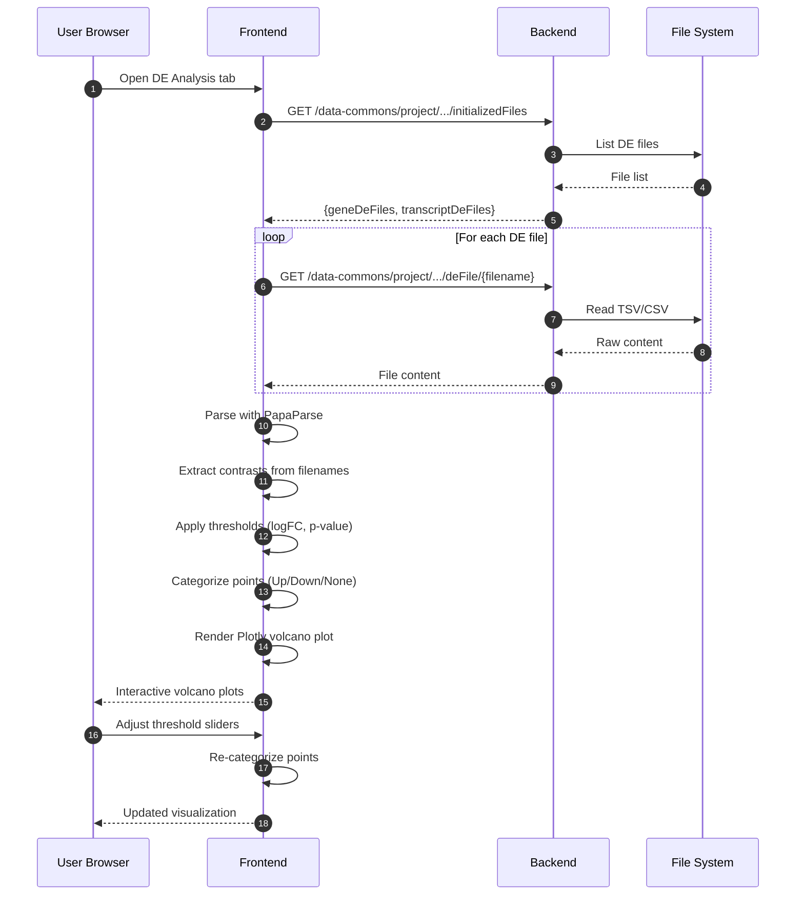
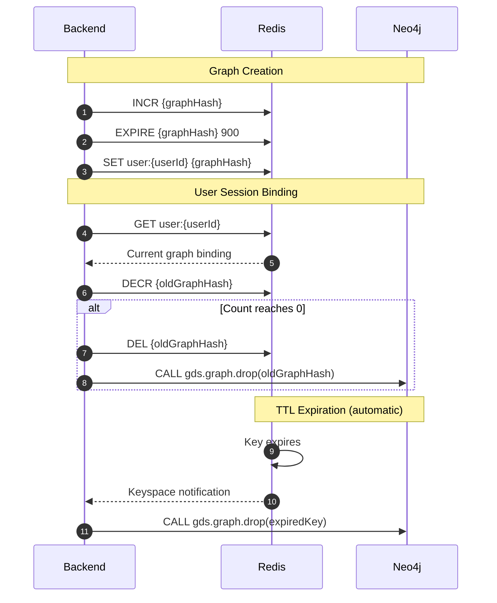
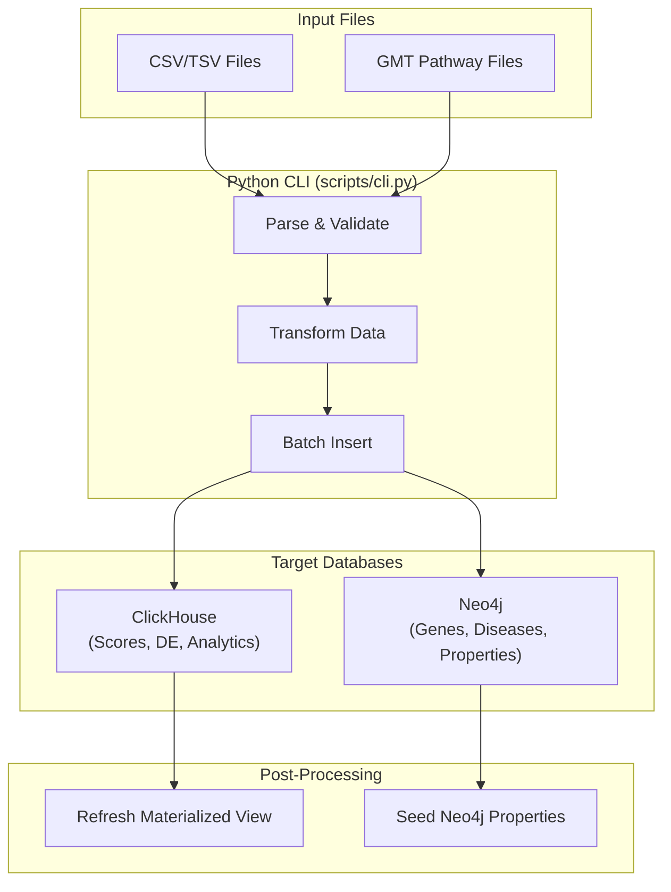
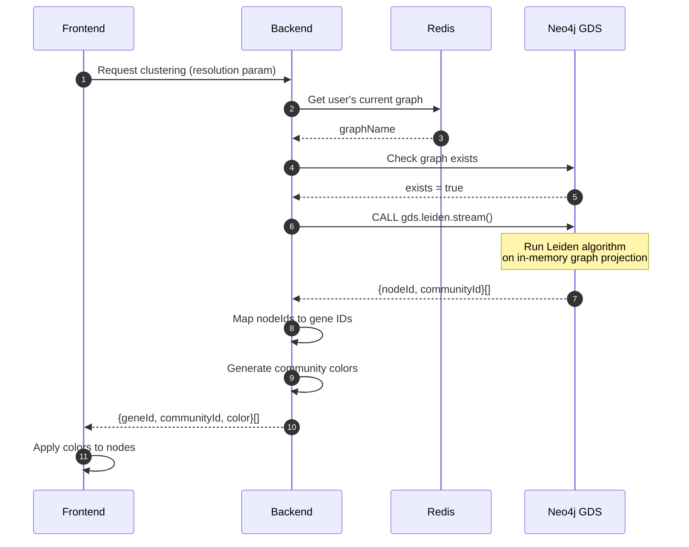

# TDP Platform - Data Flow Documentation

## Overview

This document describes the data flow patterns for key operations in the TDP platform, including graph queries, analytics queries, GSEA analysis, and data commons access.

---

## 1. Graph Query Flow (Gene Interaction Network)

User queries for protein-protein interaction networks with configurable interaction types (PPI, FUN_PPI, BIO_GRID, INT_ACT) and optional algorithm processing.

### Sequence Diagram



### Key Implementation Details

**File References**:
- Query Definition: `frontend/lib/gql.ts` → `GENE_GRAPH_QUERY`
- Resolver: `backend/src/gql/gql.resolver.ts` → `getGeneInteractions()`
- Service: `backend/src/gql/gql.service.ts` → `getGeneInteractions()`
- Cypher Queries: `backend/src/neo4j/neo4j.constants.ts`

**Graph Hash Computation**:
```typescript
// backend/src/gql/gql.service.ts
computeHash(query: string) {
  return createHash('sha256').update(query).digest('hex');
}
```

**Interaction Types**:
| Type | Description |
|------|-------------|
| `PPI` | Protein-Protein Interaction |
| `FUN_PPI` | Functional PPI |
| `BIO_GRID` | BioGRID interactions |
| `INT_ACT` | IntAct interactions |

**Order Modes**:
- `0`: Direct connections only (genes in input list)
- `1`: First-order neighbors (expand one hop)
- `2`: Second-order (internally converts to order 0 with expanded list)

---

## 2. Analytics Query Flow (Gene Properties & Association Scores)

Fetching gene properties, association scores, and differential expression data from ClickHouse.

### Sequence Diagram



### Property Categories

| Category | Table | Disease-Dependent |
|----------|-------|-------------------|
| `OPEN_TARGETS` | `overall_association_score` | Yes |
| `DIFFERENTIAL_EXPRESSION` | `differential_expression` | Yes |
| `GENETICS` | `genetics` | Yes |
| `DRUGGABILITY` | `druggability` | No |
| `PATHWAY` | `pathway` | No |
| `TISSUE_EXPRESSION` | `tissue_specificity` | No |
| `OT_PRIORITIZATION` | `target_prioritization_factors` | No |

### Target-Disease Association Table



**File References**:
- Resolver: `backend/src/gql/clickhouse.resolver.ts`
- Service: `backend/src/clickhouse/clickhouse.service.ts`
- Migrations: `backend/src/clickhouse/migrations/`

---

## 3. GSEA Analysis Flow

Gene Set Enrichment Analysis using KEGG and Reactome pathway databases.

### Sequence Diagram



### Response Format

```json
[
  {
    "Pathway": "KEGG_OXIDATIVE_PHOSPHORYLATION",
    "Overlap": "15/120",
    "P-value": "1.23e-05",
    "Adjusted P-value": "4.56e-04",
    "Odds Ratio": "3.45",
    "Combined Score": "45.67",
    "Genes": "ATP5A1,ATP5B,COX5A,..."
  }
]
```

**File References**:
- Service: `gsea/app.py`
- Pathway Files: `gsea/pathway_kegg_gsea.gmt`, `gsea/pathway_reactome_gsea.gmt`

---

## 4. Data Commons Access Flow

Authenticated access to project-specific data files (expression matrices, sample sheets, differential expression).

### Sequence Diagram



### Directory Structure

```
data-commons/data/
├── {group}/
│   ├── {program}/
│   │   ├── {project}/
│   │   │   ├── description.md
│   │   │   ├── gene_counts.csv
│   │   │   ├── transcript_counts.csv
│   │   │   ├── sample_sheet.csv
│   │   │   └── de_files/
│   │   │       ├── differential_expression_contrast1.csv
│   │   │       └── differential_expression_contrast2.csv
```

### Endpoints

| Method | Path | Purpose |
|--------|------|---------|
| `GET` | `/data-commons/structure` | List all groups/programs/projects |
| `GET` | `/data-commons/project/:g/:p/:proj/description` | Project README |
| `GET` | `/data-commons/project/:g/:p/:proj/files/:file` | Download file |
| `GET` | `/data-commons/project/:g/:p/:proj/deFile/:file` | Get DE file |
| `GET` | `/data-commons/project/:g/:p/:proj/preview/:file` | Preview file (head) |
| `POST` | `/data-commons/project/:g/:p/:proj/password` | Authenticate |
| `GET` | `/data-commons/project/:g/:p/:proj/verify-auth` | Check auth status |

**File References**:
- Controller: `backend/src/data-commons/dataCommons.controller.ts`
- Service: `backend/src/data-commons/dataCommons.service.ts`
- Prisma Schema: `backend/prisma/schema.prisma`

---

## 5. Differential Expression Visualization Flow

Processing and visualizing volcano plots from DE files.

### Sequence Diagram



### File Naming Convention

```regex
/^(?:.*)(?:(?:differential|diff)(?:[-_ ]?(?:exp|expression))?|(?:differential|de))(?:[-_ ]?)(.+?)\.(csv|tsv|xls|xlsx|txt)$/i
```

**Examples**:
- `differential_expression_contrast1.csv` → Contrast: `contrast1`
- `diff_exp_drug_vs_control.tsv` → Contrast: `drug_vs_control`

**File References**:
- Parser: `frontend/components/data-commons/DifferentialExpression/utils.ts`
- Hooks: `frontend/components/data-commons/DifferentialExpression/hooks.ts`
- Component: `frontend/components/data-commons/DifferentialExpression/DE.tsx`

---

## 6. Redis Cache & Graph Lifecycle

### Cache Key Management



### Cache Configuration

```properties
REDIS_KEY_EXPIRY=900      # 15 minutes - graph cache TTL
REDIS_USER_EXPIRY=7200    # 2 hours - user session TTL
```

**File References**:
- Redis Service: `backend/src/redis/redis.service.ts`
- Neo4j Service: `backend/src/neo4j/neo4j.service.ts` → `bindGraph()`, `onKeyExpiration()`

---

## 7. Data Ingestion Pipeline

Batch data loading from CSV/TSV files into databases.

### Pipeline Flow



### CLI Commands

```bash
# Connect to databases
python cli.py --help

# Seed ClickHouse tables
python cli.py seed-clickhouse \
  --table overall_association_score \
  --file data/association_scores.csv

# Seed Neo4j properties
python cli.py seed-neo4j-properties \
  --file data/property_definitions.csv

# Refresh materialized view
python cli.py refresh-mv
```

### Table Mappings

| Prefix | ClickHouse Table |
|--------|------------------|
| `Pathway` | `pathway` |
| `Druggability` | `druggability` |
| `TE` | `tissue_specificity` |
| `OT_Prioritization` | `target_prioritization_factors` |
| `Genetics` | `genetics` |
| `LogFC` | `differential_expression` |
| `OpenTargets` | `overall_association_score`, `datasource_association_score` |

**File References**:
- CLI: `scripts/cli.py`
- Migrations: `backend/src/clickhouse/migrations/`

---

## 8. Algorithm Execution Flow (Leiden Clustering)

### Sequence Diagram



### Algorithm Parameters

```cypher
CALL gds.leiden.stream($graphName, {
  relationshipWeightProperty: "score",
  gamma: $resolution,
  minCommunitySize: 3,
  logProgress: false
})
YIELD nodeId, communityId
RETURN gds.util.asNode(nodeId).ID AS ID, communityId
```

**File References**:
- Service: `backend/src/algorithm/algorithm.service.ts`
- Constants: `backend/src/neo4j/neo4j.constants.ts` → `LEIDEN_QUERY`
