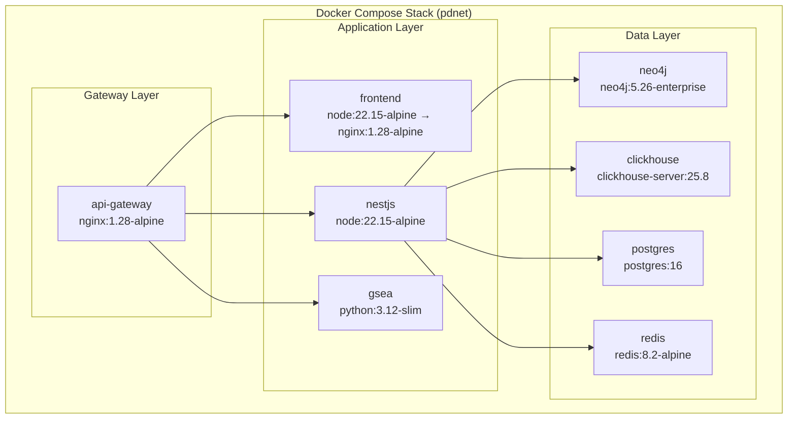
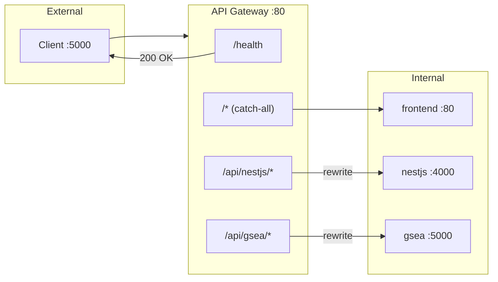

# TDP Platform - Deployment Architecture

## Container Architecture

The TDP platform runs as a set of Docker containers orchestrated via Docker Compose on a shared bridge network.

### Container Overview



---

## Docker Compose Configuration

### Production (`docker-compose.yml`)

```yaml
name: pdnet

services:
  api-gateway:
    build: ./nginx
    container_name: api-gateway
    restart: always
    ports:
      - "5000:80"           # Only exposed port in production
    depends_on:
      - nestjs
      - frontend
      - gsea
    networks:
      - pdnet-network

  neo4j:
    image: neo4j:5.26-enterprise
    container_name: neo4j
    restart: always
    environment:
      - NEO4J_AUTH=${NEO4J_USERNAME}/${NEO4J_PASSWORD}
      - NEO4J_ACCEPT_LICENSE_AGREEMENT=yes
      - NEO4J_dbms_memory_transaction_total_max=0
      - NEO4J_dbms_security_procedures_unrestricted=gds*
      - NEO4J_PLUGINS=["apoc", "graph-data-science"]
    volumes:
      - ./scripts:/var/lib/neo4j/import/
      - ../neo4j/data:/var/lib/neo4j/data
    networks:
      - pdnet-network

  nestjs:
    build: ./backend
    container_name: nestjs
    restart: always
    depends_on:
      - neo4j
      - clickhouse
      - redis
      - postgres
    env_file:
      - backend/.env
    environment:
      - DATA_COMMONS_PATH=/app/src/data-commons/data
    volumes:
      - ./backend/src/data-commons/data:/app/src/data-commons/data
    networks:
      - pdnet-network

  frontend:
    build: ./frontend
    container_name: frontend
    restart: always
    env_file:
      - frontend/.env
    networks:
      - pdnet-network

  gsea:
    build: ./gsea
    container_name: gsea
    restart: always
    networks:
      - pdnet-network

  redis:
    image: redis:8.2-alpine
    container_name: redis
    restart: always
    command: redis-server --requirepass ${REDIS_PASSWORD}
    volumes:
      - redis-cache:/data
    networks:
      - pdnet-network

  clickhouse:
    image: clickhouse/clickhouse-server:25.8
    container_name: clickhouse
    restart: always
    volumes:
      - clickhouse-data:/var/lib/clickhouse
      - ./scripts/data/backup:/backup
    environment:
      - CLICKHOUSE_USER=${CLICKHOUSE_USER}
      - CLICKHOUSE_PASSWORD=${CLICKHOUSE_PASSWORD}
    networks:
      - pdnet-network

  postgres:
    image: postgres:16
    container_name: postgres
    restart: always
    environment:
      - POSTGRES_USER=${POSTGRES_USER}
      - POSTGRES_PASSWORD=${POSTGRES_PASSWORD}
      - POSTGRES_DB=${POSTGRES_DB}
    volumes:
      - postgres-data:/var/lib/postgresql/data
    networks:
      - pdnet-network

volumes:
  redis-cache:
  clickhouse-data:
  postgres-data:

networks:
  pdnet-network:
    driver: bridge
```

### Development Override (`docker-compose.dev.yml`)

```yaml
services:
  api-gateway:
    ports:
      - "8080:80"       # Alternative gateway port

  nestjs:
    ports:
      - "4000:4000"     # Direct backend access

  frontend:
    ports:
      - "3000:80"       # Direct frontend access

  gsea:
    ports:
      - "5000:5000"     # Direct GSEA access

  clickhouse:
    ports:
      - "8123:8123"     # HTTP interface
      - "9000:9000"     # Native TCP interface

  redis:
    ports:
      - "6379:6379"     # Redis CLI access

  neo4j:
    ports:
      - "7474:7474"     # Neo4j Browser
      - "7687:7687"     # Bolt protocol

  postgres:
    ports:
      - "5432:5432"     # psql access
```

### Usage Commands

```bash
# Production deployment
docker compose up -d

# Development with port exposure
docker compose -f docker-compose.yml -f docker-compose.dev.yml up -d

# Rebuild specific service
docker compose build --no-cache frontend
docker compose up -d frontend
docker compose restart api-gateway  # Required after frontend rebuild

# View logs
docker compose logs -f nestjs

# Scale services (if needed)
docker compose up -d --scale gsea=2
```

---

## Volume Mounts

| Volume | Type | Container | Mount Point | Purpose |
|--------|------|-----------|-------------|---------|
| `redis-cache` | Named | redis | `/data` | Redis persistence |
| `clickhouse-data` | Named | clickhouse | `/var/lib/clickhouse` | ClickHouse data |
| `postgres-data` | Named | postgres | `/var/lib/postgresql/data` | PostgreSQL data |
| `./scripts` | Bind | neo4j | `/var/lib/neo4j/import/` | Data import |
| `../neo4j/data` | Bind | neo4j | `/var/lib/neo4j/data` | Graph database |
| `./backend/src/data-commons/data` | Bind | nestjs | `/app/src/data-commons/data` | Data commons files |
| `./scripts/data/backup` | Bind | clickhouse | `/backup` | Backup directory |

---

## Nginx Gateway Configuration

### Route Mapping (`nginx/nginx.conf`)

```nginx
upstream frontend {
    server frontend:80;
}

upstream nestjs {
    server nestjs:4000;
}

upstream gsea {
    server gsea:5000;
}

server {
    listen 80;
    server_name localhost;

    # Buffer configuration for large responses
    proxy_buffer_size 128k;
    proxy_buffers 4 256k;
    proxy_busy_buffers_size 256k;

    # Timeout settings (10 minutes)
    proxy_connect_timeout 600s;
    proxy_send_timeout 600s;
    proxy_read_timeout 600s;
    send_timeout 600s;

    # NestJS API routes
    location /api/nestjs/ {
        rewrite ^/api/nestjs/(.*)$ /$1 break;
        proxy_pass http://nestjs;
        proxy_http_version 1.1;
        proxy_set_header Upgrade $http_upgrade;
        proxy_set_header Connection 'upgrade';
        proxy_set_header Host $host;
        proxy_set_header X-Real-IP $remote_addr;
        proxy_set_header X-Forwarded-For $proxy_add_x_forwarded_for;
        proxy_set_header X-Forwarded-Proto $scheme;
        
        # Cookie support for authentication
        proxy_set_header Cookie $http_cookie;
        proxy_pass_header Set-Cookie;
        
        proxy_cache_bypass $http_upgrade;
    }

    # GSEA Python API routes
    location /api/gsea {
        rewrite ^/api/gsea/?(.*)$ /$1 break;
        proxy_pass http://gsea;
        proxy_http_version 1.1;
        proxy_set_header Upgrade $http_upgrade;
        proxy_set_header Connection 'upgrade';
        proxy_set_header Host $host;
        proxy_cache_bypass $http_upgrade;
    }

    # Health check endpoint
    location /health {
        access_log off;
        return 200 "healthy\n";
        add_header Content-Type text/plain;
    }

    # Frontend routes (catch-all)
    location / {
        proxy_pass http://frontend;
        proxy_http_version 1.1;
        proxy_set_header Upgrade $http_upgrade;
        proxy_set_header Connection 'upgrade';
        proxy_set_header Host $host;
        proxy_cache_bypass $http_upgrade;
    }

    # Gzip compression
    gzip on;
    gzip_vary on;
    gzip_proxied any;
    gzip_comp_level 6;
    gzip_types text/plain text/css text/xml text/javascript 
               application/json application/javascript 
               application/xml+rss font/truetype font/opentype 
               image/svg+xml;
}
```

### Request Flow Diagram



---

## Dockerfile Specifications

### Backend (`backend/Dockerfile`)

```dockerfile
FROM node:22.15-alpine AS base
WORKDIR /app

FROM base AS deps
ENV PNPM_HOME="/pnpm"
ENV PATH="$PNPM_HOME:$PATH"
RUN corepack enable && corepack prepare pnpm@10.18.3 --activate
COPY package.json pnpm-lock.yaml ./

FROM deps AS prod-deps
RUN --mount=type=cache,id=pnpm,target=/pnpm/store pnpm install --prod --frozen-lockfile

FROM deps AS build
RUN --mount=type=cache,id=pnpm,target=/pnpm/store pnpm install --frozen-lockfile
COPY . .
RUN pnpm exec prisma generate
RUN pnpm run build

FROM base
COPY --from=prod-deps /app/node_modules /app/node_modules
COPY --from=build /app/dist /app/dist
COPY --from=build /app/prisma /app/prisma
COPY --from=build /app/generated /app/generated
COPY --from=build /app/src/clickhouse/migrations /app/src/clickhouse/migrations

CMD ["sh", "-c", "npx prisma db push && node dist/main"]
```

**Build Stages**:
1. `base` - Node.js Alpine base
2. `deps` - pnpm installation
3. `prod-deps` - Production dependencies only
4. `build` - TypeScript compilation + Prisma generation
5. `runtime` - Minimal production image

### Frontend (`frontend/Dockerfile`)

```dockerfile
FROM node:22.15-alpine AS builder
WORKDIR /app

ENV PNPM_HOME="/pnpm"
ENV PATH="$PNPM_HOME:$PATH"
RUN corepack enable

COPY package.json pnpm-lock.yaml ./
RUN --mount=type=cache,id=pnpm,target=/pnpm/store pnpm install --frozen-lockfile
COPY . .
RUN pnpm run build

FROM nginx:1.28-alpine
RUN apk add --no-cache apache2-utils

RUN rm /etc/nginx/conf.d/default.conf
COPY ./nginx/nginx.conf /etc/nginx/conf.d/default.conf

# Copy static export
COPY --from=builder /app/out/video /usr/share/nginx/html/video
COPY --from=builder /app/out/image /usr/share/nginx/html/image
COPY --from=builder /app/out/*.csv /usr/share/nginx/html/
COPY --from=builder /app/out/favicon.ico /usr/share/nginx/html/
COPY --from=builder /app/out/docs /usr/share/nginx/html/docs
COPY --from=builder /app/out/_next /usr/share/nginx/html/_next
COPY --from=builder /app/out/_pagefind /usr/share/nginx/html/_pagefind
COPY --from=builder /app/out/*.txt /usr/share/nginx/html/
COPY --from=builder /app/out/*.html /usr/share/nginx/html/
COPY --from=builder /app/out/*.xml /usr/share/nginx/html/

COPY ./nginx/entrypoint.sh /entrypoint.sh
RUN chmod +x /entrypoint.sh

EXPOSE 80
ENTRYPOINT [ "/entrypoint.sh" ]
```

**Note**: Frontend uses `output: "export"` for static site generation, served via Nginx.

### GSEA Service (`gsea/Dockerfile`)

```dockerfile
FROM python:3.12-slim

ENV PYTHONDONTWRITEBYTECODE=1 \
    PYTHONUNBUFFERED=1 \
    UV_COMPILE_BYTECODE=1 \
    UV_LINK_MODE=copy

WORKDIR /app

# Install uv package manager
COPY --from=docker.io/astral/uv:0.9 /uv /uvx /bin/

COPY pyproject.toml uv.lock ./
RUN --mount=type=cache,target=/root/.cache/uv \
    uv sync --frozen --no-install-project --no-dev

COPY . .
RUN uv sync --frozen --no-dev

CMD ["uv", "run", "uvicorn", "app:app", "--host", "0.0.0.0", "--port", "5000", "--workers", "2"]
```

**Note**: Uses `uv` for fast Python dependency management with 2 uvicorn workers.

---

## Environment Configuration

### Root `.env` (Docker Compose)

```properties
# Neo4j
NEO4J_USERNAME=neo4j
NEO4J_PASSWORD=<secure-password>

# Redis
REDIS_PASSWORD=<secure-password>

# ClickHouse
CLICKHOUSE_USER=default
CLICKHOUSE_PASSWORD=<secure-password>

# PostgreSQL
POSTGRES_USER=postgres
POSTGRES_PASSWORD=<secure-password>
POSTGRES_DB=auth_db
```

### Backend `.env`

```properties
# Neo4j (use container names)
NEO4J_SCHEME=bolt
NEO4J_HOST=neo4j
NEO4J_PORT=7687
NEO4J_DATABASE=pdnet
NEO4J_USERNAME=neo4j
NEO4J_PASSWORD=<password>
NEO4J_MAX_POOL_SIZE=10

# Redis
REDIS_HOST=redis
REDIS_PORT=6379
REDIS_PASSWORD=<password>
REDIS_KEY_EXPIRY=900
REDIS_USER_EXPIRY=7200

# ClickHouse
CLICKHOUSE_URL=http://clickhouse:8123
CLICKHOUSE_USER=default
CLICKHOUSE_PASSWORD=<password>

# PostgreSQL
POSTGRES_URL=postgresql://postgres:<password>@postgres:5432/auth_db

# Application
PORT=4000
NODES_LIMIT=5000
EDGES_LIMIT=10000
JWT_SECRET=<secure-secret>
NODE_ENV=production
FRONTEND_URL=https://your-domain.com
```

---

## Health Checks

### Gateway Health

```bash
curl http://localhost:5000/health
# Response: healthy
```

### Service-Level Checks

```bash
# Backend GraphQL
curl -X POST http://localhost:5000/api/nestjs/graphql \
  -H "Content-Type: application/json" \
  -d '{"query":"{ __typename }"}'

# GSEA
curl http://localhost:5000/api/gsea/
# Response: "Welcome to TBEP Python API!"

# Neo4j
docker exec neo4j cypher-shell -u neo4j -p <password> "RETURN 1"

# ClickHouse
docker exec clickhouse clickhouse-client --query "SELECT 1"

# PostgreSQL
docker exec postgres psql -U postgres -c "SELECT 1"

# Redis
docker exec redis redis-cli -a <password> ping
# Response: PONG
```

---

## Deployment Commands Reference

```bash
# Full stack deployment
docker compose up -d --build

# Production only (no port exposure)
docker compose -f docker-compose.yml up -d

# Development with debugging
docker compose -f docker-compose.yml -f docker-compose.dev.yml up -d

# Rebuild and restart single service
docker compose build --no-cache nestjs
docker compose up -d nestjs

# Database backups
docker exec neo4j neo4j-admin database dump pdnet --to-path=/backup
docker exec clickhouse clickhouse-client --query "BACKUP DATABASE default TO '/backup/ch_backup'"
docker exec postgres pg_dump -U postgres auth_db > backup.sql

# View real-time logs
docker compose logs -f --tail=100 nestjs gsea

# Resource usage
docker stats

# Clean up
docker compose down
docker compose down -v  # Also remove volumes (destructive!)
docker system prune -a  # Remove all unused images
```

---

## Scaling Considerations

| Component | Scaling Strategy | Notes |
|-----------|------------------|-------|
| Frontend | Horizontal | Stateless static files |
| Backend | Horizontal | Stateless, uses Redis for shared state |
| GSEA | Horizontal | Stateless, CPU-bound |
| Neo4j | Vertical / Cluster | GDS requires single node or Neo4j Cluster |
| ClickHouse | ClickHouse Cluster | For large datasets |
| Redis | Redis Cluster/Sentinel | For HA |
| PostgreSQL | Primary-Replica | For HA |

### Load Balancing Example

```yaml
# docker-compose.scale.yml
services:
  nestjs:
    deploy:
      replicas: 3
      
  gsea:
    deploy:
      replicas: 2
```

```nginx
# nginx.conf with load balancing
upstream nestjs {
    least_conn;
    server nestjs_1:4000;
    server nestjs_2:4000;
    server nestjs_3:4000;
}
```
