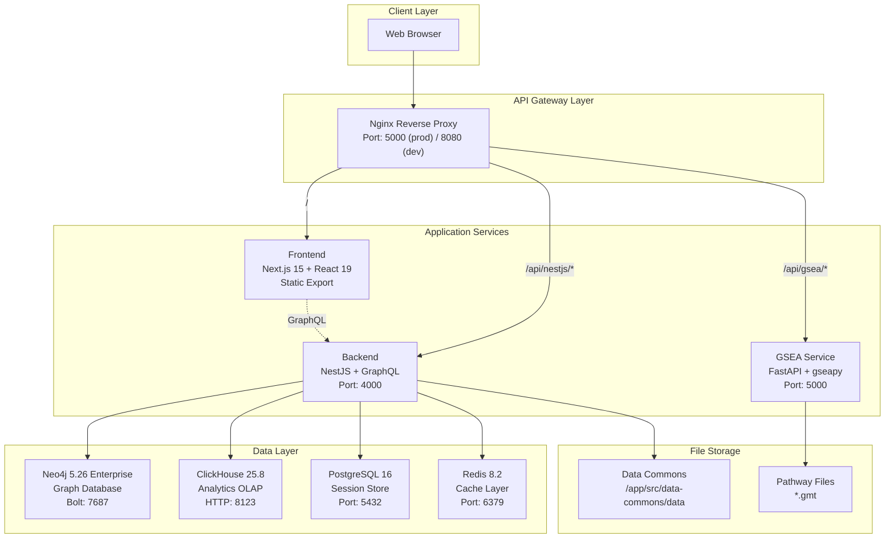
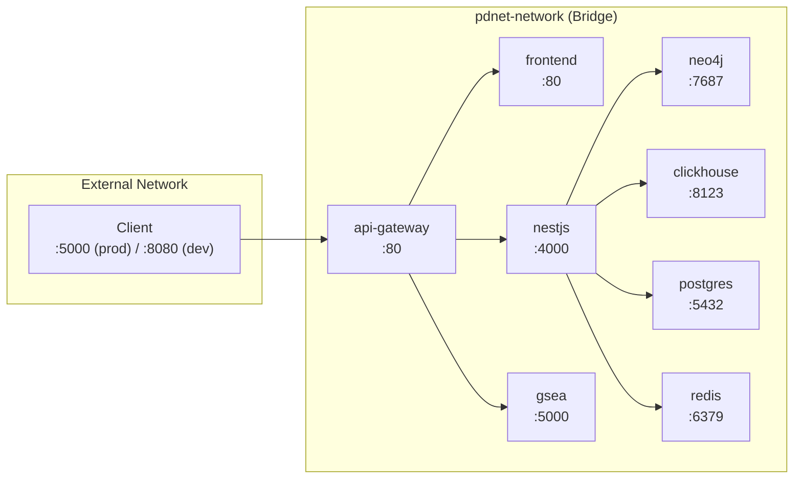

# TDP Platform - System Overview

## Introduction

The **Target Discovery Platform (TDP)** is a comprehensive bioinformatics platform designed for pharmaceutical research, enabling advanced drug target discovery through protein-protein interaction networks, gene expression analysis, and pathway enrichment.

The platform integrates multiple data sources including Open Targets, KEGG, Reactome, and BioGRID to provide researchers with powerful tools for identifying and validating drug targets.

## Architecture Summary

TDP follows a **microservices architecture** with the following core components:

| Component | Technology | Port | Purpose |
|-----------|------------|------|---------|
| API Gateway | Nginx 1.28 | 80 (internal), 5000 (prod), 8080 (dev) | Request routing, load balancing, compression |
| Frontend | Next.js 15, React 19 | 80 (internal), 3000 (dev) | Server-side rendered web application |
| Backend | NestJS, GraphQL | 4000 | Business logic, data orchestration |
| GSEA Service | Python/FastAPI | 5000 | Gene Set Enrichment Analysis |
| Graph Database | Neo4j 5.26 Enterprise | 7687 (Bolt), 7474 (HTTP) | Protein-protein interactions, gene relationships |
| Analytics Database | ClickHouse 25.8 | 8123 (HTTP), 9000 (TCP) | High-performance columnar analytics |
| Session Store | PostgreSQL 16 | 5432 | User sessions, feedback, access control |
| Cache Layer | Redis 8.2 | 6379 | Query caching, session management |

## High-Level Architecture



## Network Architecture

All services communicate over an internal Docker bridge network (`pdnet-network`), with only the API Gateway exposed externally.



## Service Responsibilities

### Frontend (`frontend/`)

**Technology**: Next.js 15, React 19, TailwindCSS, shadcn/ui

**Key Features**:
- Static site generation with `output: "export"`
- App Router with route groups: `(navbar)`, `(sidebar)`
- GraphQL client (Apollo Client 4.x)
- Interactive graph visualization (Sigma.js, Graphology)
- Data visualization (Plotly, Recharts)
- File upload and parsing (PapaParse)
- Documentation with Nextra

**Key Directories**:
| Path | Purpose |
|------|---------|
| `app/(navbar)/` | Main application routes with navigation |
| `app/docs/` | Documentation pages (Nextra) |
| `app/network/` | Network visualization routes |
| `app/data/` | Data commons browser |
| `components/graph/` | Graph visualization components |
| `components/data-commons/` | Data analysis components |
| `lib/gql.ts` | GraphQL query definitions |

### Backend (`backend/`)

**Technology**: NestJS, GraphQL (code-first), Prisma ORM

**Key Modules**:
| Module | Path | Purpose |
|--------|------|---------|
| `GqlModule` | `src/gql/` | GraphQL resolvers for gene/disease queries |
| `Neo4jModule` | `src/neo4j/` | Graph database interactions with session pooling |
| `ClickhouseModule` | `src/clickhouse/` | Analytics queries with migrations |
| `RedisModule` | `src/redis/` | Query caching with key expiration events |
| `DataCommonsModule` | `src/data-commons/` | File serving with JWT authentication |
| `FeedbackModule` | `src/feedback/` | User feedback management |
| `AlgorithmModule` | `src/algorithm/` | Graph algorithms (Leiden clustering) |

**GraphQL Schema** (`src/schema.gql`):
- `genes`: Gene metadata lookup
- `getGeneInteractions`: PPI network queries
- `geneProperties`: Multi-category gene properties
- `headers`: Dynamic column headers by disease
- `topGenesByDisease`: Top associated genes
- `targetDiseaseAssociationTable`: Open Targets data

### GSEA Service (`gsea/`)

**Technology**: Python 3.12, FastAPI, gseapy, pandas

**Endpoints**:
| Method | Path | Purpose |
|--------|------|---------|
| `POST` | `/` | Run GSEA analysis |
| `GET` | `/` | Health check |

**Pathway Databases**:
- `pathway_kegg_gsea.gmt` - KEGG pathways
- `pathway_reactome_gsea.gmt` - Reactome pathways

### Data Ingestion CLI (`scripts/`)

**Technology**: Python, Click, pandas, clickhouse-connect, neo4j

**Purpose**: Database population and maintenance

**Key Commands**:
```bash
# ClickHouse data ingestion
python cli.py seed-clickhouse --table <table_name> --file <data.csv>

# Neo4j property seeding
python cli.py seed-neo4j-properties --file <properties.csv>

# Refresh materialized views
python cli.py refresh-mv
```

## Port Mapping Reference

### Production (`docker-compose.yml`)

| Service | Internal Port | External Port |
|---------|---------------|---------------|
| api-gateway | 80 | **5000** |
| frontend | 80 | - |
| nestjs | 4000 | - |
| gsea | 5000 | - |
| neo4j | 7687, 7474 | - |
| clickhouse | 8123, 9000 | - |
| postgres | 5432 | - |
| redis | 6379 | - |

### Development (`docker-compose.dev.yml`)

| Service | Internal Port | External Port |
|---------|---------------|---------------|
| api-gateway | 80 | **8080** |
| frontend | 80 | **3000** |
| nestjs | 4000 | **4000** |
| gsea | 5000 | **5000** |
| neo4j | 7687, 7474 | **7687**, **7474** |
| clickhouse | 8123, 9000 | **8123**, **9000** |
| postgres | 5432 | **5432** |
| redis | 6379 | **6379** |

## Key Technologies

### Frontend Stack
- **Framework**: Next.js 15 with App Router
- **UI**: React 19, TailwindCSS, shadcn/ui (Radix primitives)
- **State**: Zustand, Apollo Client cache
- **Visualization**: Sigma.js, Plotly, Recharts
- **Data**: Apollo Client 4.x, PapaParse

### Backend Stack
- **Framework**: NestJS with GraphQL
- **ORM**: Prisma (PostgreSQL)
- **Drivers**: neo4j-driver, @clickhouse/client, ioredis
- **Auth**: JWT (jsonwebtoken), cookie-parser

### Infrastructure
- **Containerization**: Docker, Docker Compose
- **Gateway**: Nginx with gzip, proxy buffering
- **CI/CD**: Husky pre-commit hooks

## Environment Variables

### Backend (`backend/.env`)

```properties
# Neo4j Configuration
NEO4J_SCHEME=bolt
NEO4J_HOST=neo4j          # Container name in Docker
NEO4J_PORT=7687
NEO4J_DATABASE=pdnet
NEO4J_USERNAME=neo4j
NEO4J_PASSWORD=<password>
NEO4J_MAX_POOL_SIZE=10

# Redis Configuration
REDIS_HOST=redis          # Container name in Docker
REDIS_PORT=6379
REDIS_PASSWORD=<password>
REDIS_KEY_EXPIRY=900      # Cache TTL in seconds
REDIS_USER_EXPIRY=7200    # User session TTL

# ClickHouse Configuration
CLICKHOUSE_URL=http://clickhouse:8123
CLICKHOUSE_USER=default
CLICKHOUSE_PASSWORD=<password>

# PostgreSQL Configuration
POSTGRES_URL=postgresql://postgres:<password>@postgres:5432/auth_db

# Application Configuration
PORT=4000
NODES_LIMIT=5000          # Max nodes in graph response
EDGES_LIMIT=10000         # Max edges in graph response
JWT_SECRET=<secret>
NODE_ENV=production
```

### Frontend (`frontend/.env`)

```properties
NEXT_PUBLIC_BACKEND_URL=/api/nestjs
NEXT_PUBLIC_GSEA_URL=/api/gsea
```

## Cron Jobs

The backend includes scheduled tasks (`backend/src/cron/`):

| Schedule | Task | Purpose |
|----------|------|---------|
| `0 */6 * * *` | `cleanupOldData()` | PostgreSQL session cleanup (4x daily) |

## Security Considerations

1. **Network Isolation**: All services on internal Docker network
2. **JWT Authentication**: Data Commons file access
3. **Cookie Security**: HTTP-only, Secure, SameSite=Strict (production)
4. **CORS**: Restricted to frontend URL in production
5. **Redis Key Expiration**: Automatic graph cleanup on TTL expiry
